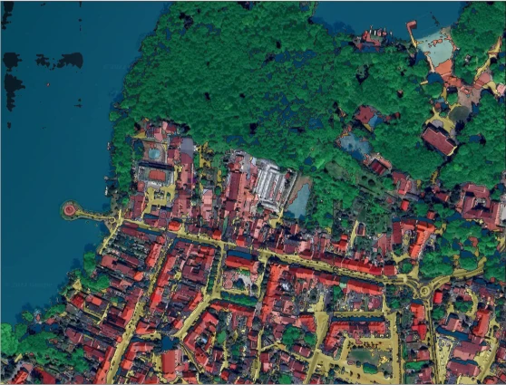

# LandCover Segmentation



## Description

This repository is an example pipeline for training and evaluating the segmentation model for [Deepness: Deep Neural Remote Sensing plugin for QGIS](https://qgis-plugin-deepness.readthedocs.io/en/latest/index.html).

This repository contains code for training and evaluating the LandCover segmentation model based on the [LandCover.ai dataset](https://landcover.ai.linuxpolska.com/).

Ready-to-use model and example inference in QGIS are available in our [LandCover segmentation example](https://qgis-plugin-deepness.readthedocs.io/en/latest/example/example_segmentation_landcover.html).

## Requirements

Create your Python 3 virtual environment and install requirements:

```bash
pip3 install -r requirements.txt
```


## Usage
  
* Prepare dataset for training and evaluation

  ```commandline
  # create a directory for the dataset
  mkdir data/LandCover

  # move to the dataset directory
  cd data/LandCover

  # download dataset
  wget "https://landcover.ai.linuxpolska.com/download/landcover.ai.v1.zip"
  
  # extract dataset
  unzip landcover.ai.v1.zip
  
  # (optionally) remove the zip file
  rm landcover.ai.v1.zip
  
  # create train-val-test split
  python3 split.py
  ```
  
* Logging configuration 

  * NEPTUNE

    If you want to use Neptune logger, you have to set your keys:

    ```commandline
    export NEPTUNE_API_TOKEN=""
    export NEPTUNE_PROJECT_NAME=""
    ```

  * NONE

    If you don't want to use any logger, just add ` ~logger` in the commands below.


* Run training pipeline
  ```commandline
  python run.py name=landseg
  ```
    
* You can run an evaluation pipeline if you have trained model
  ```commandline
  python run.py name=landseg eval_mode=True trainer.resume_from_checkpoint=./path/to/model
  ```

* Run export pipeline to export model to ONNX format to use it in QGIS
  ```commandline
  python run.py name=landseg eval_mode=True trainer.resume_from_checkpoint=./path/to/model export.export_to_onnx=True
  ```
